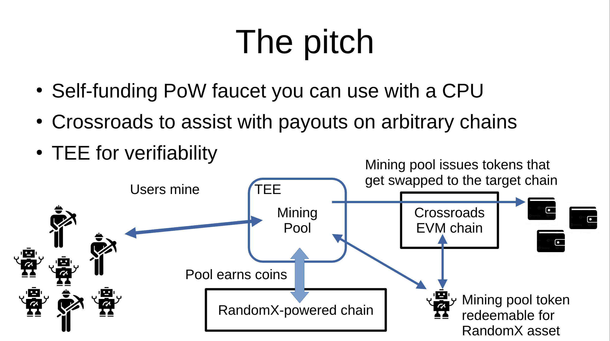
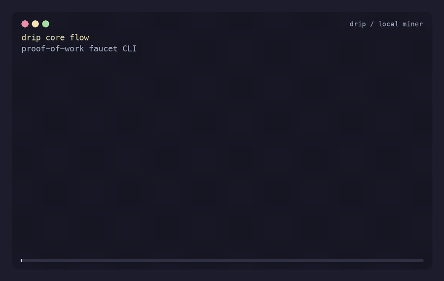

# Infinite Drip

A universal proof-of-work faucet.

Developers and agents still need tiny amounts of crypto to build, test, sign,
bridge, deploy, and recover from empty-wallet states. Existing faucets are
centralized, rate-limited, captcha-heavy, social-login gated, or just dry. The
core problem is simple: tokens have value, so a faucet cannot be a pure
handout forever.

Infinite Drip makes the user provide value first.

```text
CPU work -> RandomX mining revenue -> signed faucet credit -> target token
```

Users install one CLI, `drip`. They do not install XMRig, run Tor, find a pool,
or understand Monero. They choose the chain, token, and recipient they want;
the faucet turns local CPU work into redeemable credit and routes value through
the wider Infinite Drip system.

The main protocol, backend, pool, contract, and routing work lives at
[github.com/infinite-drip-faucet](https://github.com/infinite-drip-faucet).
This repository is the client interface: local identity, bundled mining client,
process lifecycle, status, vouchers, and withdrawal intent.

## How It Works



First principles:

```text
1. Access should not require existing crypto.
2. Faucet value should be funded by useful work, not arbitrary trust.
3. CPU mining is the broadest available proof-of-work interface.
4. Users should ask for the asset they need, not manage mining infrastructure.
```

The CLI creates a local Ethereum keypair, starts bundled XMRig, mines against
the production RandomX endpoint, reads faucet accounting, caches the latest
cumulative signed voucher, and records the chain/token/recipient the user wants.

## Use



```bash
drip identity
drip start --threads 1
drip status
drip checkpoint
drip withdraw base-sepolia eth 0x1111111111111111111111111111111111111111
drip stop
```

Production endpoints are built in:

```text
API  = https://p8080.m269.opf-mainnet-rofl-55.rofl.app
Pool = stratum+ssl://p3333.m269.opf-mainnet-rofl-55.rofl.app:443
```

`drip withdraw` is the client-side payout intent. Final token delivery is owned
by the external Infinite Drip backend, contracts, and Crossroads integration.

## Install

Use the release archive for your platform:

```text
drip-darwin-arm64.tar.gz
drip-linux-amd64.tar.gz
```

Install:

```bash
platform=drip-darwin-arm64
mkdir -p ~/.local/opt ~/.local/bin
tar -xzf "$platform.tar.gz" -C ~/.local/opt
ln -sf "$HOME/.local/opt/$platform/drip" ~/.local/bin/drip
export PATH="$HOME/.local/bin:$PATH"
drip --help
```

macOS unsigned-build workaround:

```bash
xattr -dr com.apple.quarantine ~/.local/opt/drip-darwin-arm64
```

## What This Repo Owns

```text
cli/        Rust CLI source
scripts/    XMRig and drip packaging
docs/       CLI integration docs, pitch material, demos
```

This repo does not own the faucet backend, Stratum server, accounting database,
contracts, relayer, or Crossroads routing. Those integration points are
documented here so the client can plug into the main system cleanly.

## Build

```bash
cargo test --workspace
DRIP_XMRIG_PLATFORM=darwin-arm64 scripts/package-drip.sh
```

Linux packages are built on Linux runners:

```bash
DRIP_XMRIG_PLATFORM=linux-amd64 scripts/package-xmrig.sh
DRIP_XMRIG_PLATFORM=linux-amd64 scripts/package-drip.sh
```

The archive bundles:

```text
drip
third_party/xmrig/<platform>/xmrig
```

## Status

Verified live:

```text
bundled XMRig connects to the ROFL Stratum endpoint over TLS/SNI
RandomX jobs are received
accepted shares are credited by the faucet API
drip status reads live pool/miner accounting
drip checkpoint caches signed cumulative vouchers
drip withdraw captures target chain/token/recipient intent
```

## References

```text
docs/faucet-integration.md                 API and Stratum integration boundary
docs/handoff.md                            technical CLI handoff
docs/cli-usage.md                          user install/run guide
docs/demo/drip-core-flow.mp4               15-second CLI demo
docs/assets/architecture-pitch.png         pitch architecture visual
docs/pitch/infinite-drip-universal-crypto-faucet.pdf
docs/pitch/universal-faucet-project.pdf
```
